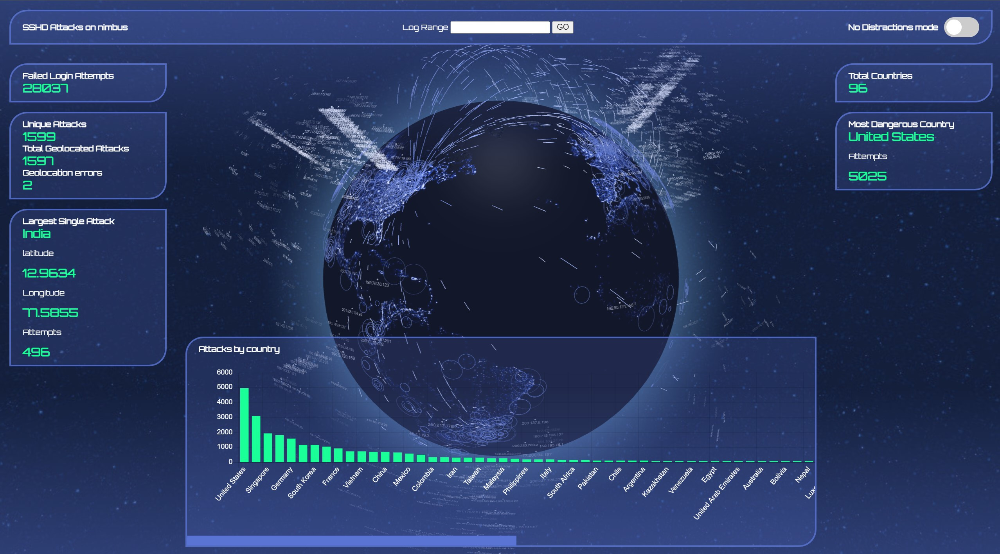

# SSHD Auth.log visualizer



## Overview

This is a dashboard which represents failed log in attempts on the SSHD service by parsing the auth.log file on Linux based servers.

## Statistics/Features

- Total Countries
- Country with most login attempts
- Login attempts by country
- Total failed login attempts
- Total unique attackers
- Geolocation of attempts
- Largest single attack
- Filter logs by date range
- Caching of parsed logs for startup speed
- No Distractions mode (Hide everything except for the navigation)
- Mobile/Desktop viewing. (Mobile does not show stats)

## Disclaimer

Since this visualization was made mirroring my current server setup, the log parser in the project `helpers/authLogParser.js` only looks for non-existent usernames, not incorrect passwords. My server does not use passwords, but rather ssh public key authentication. Lets take an example from this log.

```
Mar  1 00:59:03 nimbus sshd[1638]: Invalid user zhenli from 93.43.56.134 port 56502
Mar  1 00:59:03 nimbus sshd[1638]: Received disconnect from 93.43.56.134 port 56502:11: Bye Bye [preauth]
Mar  1 00:59:03 nimbus sshd[1638]: Disconnected from invalid user zhenli 93.43.56.134 port 56502 [preauth]
Mar  1 00:59:07 nimbus sudo: pam_unix(sudo:session): session closed for user root
Mar  1 01:00:57 nimbus sshd[1642]: Invalid user mazhuang from 93.43.56.134 port 50706
```

The output of these logs would equate to:

| ip           | port  | user     | lat | lng |
| ------------ | ----- | -------- | --- | --- |
| 93.43.56.134 | 56502 | zhenli   | ... | ... |
| 93.43.56.134 | 50706 | mazhuang | ... | ..  |
|              |       |          | ... | ... |

## Clone

Create a local copy of this project

```
git clone https://github.com/MrWebMD/authlog-visualizer
```

## Dependencies

**Maxmine GeoLite2-City database**

This program uses a free ip geolocation database probided by MaxMind. The database is included in this repo, but you may download an updated version of the database by following the instructions here. Just make sure to download the GeoLite2-City database in the .mmdb format, then replace the database within the databases folder.

https://dev.maxmind.com/geoip/geolite2-free-geolocation-data

**NodeJS dependencies**

Navigate to the root folder of this project and run

```
npm install
```

**Logs, logs, logs!**

If your project does not already have a `logs` folder, create a folder named `logs` at the root of this project.

On a linux distribution running an SSH server, navigate to `/var/log/auth.log` and copy that file into this projects `logs` folder. If there are compressed logs saved, then decompress them and copy them to the `logs` folder of this project. At this point, all that is required is to configure your settings to recognize these logs.

## Settings

This project requires that you specify a relative path to the log files which should be parsed.

config.yml

```yaml
---
logs:
  - path: logs/auth.log
    year: 2023
  - path: logs/auth.log.1
    year: 2023
  - path: logs/auth.log.2
    year: 2023
  - path: logs/auth.log.3
    year: 2023
appSettings:
  originServer:
    label: "nimbus"
    lat: 40.793
    lng: -74.0247
```

**logs (required)**

From the top, the required `logs` key contains an array of objects in the form of `{path: string, year: number}`. The logs array must contain at least one log file, and that log file must have at least two valid entries to be visualized.

**path (required)**

`path` is a required string which locates the log file within the `logs` folder.

**year (required)**

`year` is a required number which details what time of year these logs were recorded. The auth.log does not contain a year in the timestamp. The year provided will be appended to every timestamp at the beginning of every line in the auth.log file in order to create a complete timestamp.

**appSettings (required)**

The `appSettings` key passed to the frontend in order to give you more control of the visualization. See below

**originServer (required)**

This key describes how your server shows on the globe.

**label (required)**

`label` is a string which will be used to mark your server on the globe.

**lat & lng (required)**

`lat` and `lng` is short for latitude and longitude respectively. This is the geographical coordinate of where your server is located on Earth.

You can use google maps to generate a lat and lng value, or an online geoip service. This value is not calculated by the program in order to give you control.

https://geoip.com/

## Running the program

**The OG way**

Navigate to the root directory of the project and run the folllowing command. The program by default serves the website on https://localhost:80

```
npm start
```

**The Docker way**

Docker serves the application on https://localhost:3013

```
docker compose up
```
